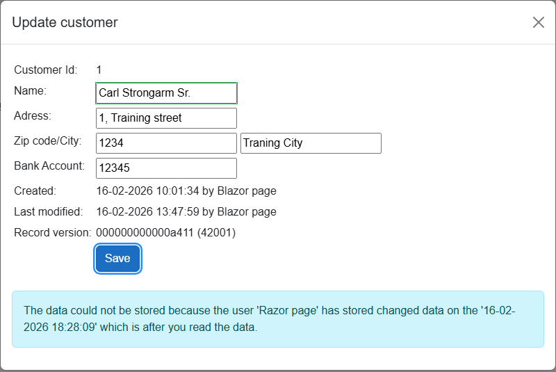

# Handle concurrency when editing data in Blazor and Razor applications

This repo contains complete examples of how to implement, use and manage concurrency control in a web application made
with Blazor, Razor and REST API as well.

I seldom see complete examples of how to manage concurrency issues, so I desided to publish a series of articles about 
concurrency handling. Also I created this repo, that contains abstractions, components, and methods that, after some
modification, can be implemented in your own system.

In the repo one project contains the database models and repository classes and two projects are demo web applications, one
made with Blazor and one made with Razor pages. The purpose of these demo web sites is to show practical examples on how to
implement check for concurrency conflicts and how to handle it.

This documentation covers all general aspects of concurrency control.

## Disclaimer

The purpose of this demo is to show how to manage concurrency control in Blazor and Razor web applications. The demo
applications and APIs are not implemented as you would normally in a production application. There is no use of
authority, validations are at a bare minimum. All, because the purpose is to show details about how to handle
concurrency.

## Fully functional example projects

The two demo web sites covers how to implement 'optimistic' locking of records 
in a Blazor or Razor web application, as well as in a REST API.

The repo also shows how to implement 'optimistic' locking for a subset of fields in a table record (see Product and
associated classes).

The projects must use Microsoft SQL Server (Express works as well).

### Up and running
To get the demo up and running, you must download this repo.

You must then rename the two 'appsettigs.Development.json.example' files to 'appsettings.Development.json' and edit
them so that the connection string points to your SQL (Express) Server. The two files are located in the Blazor demo and
in the Razor demo.

First time you run the demo application, the database and tables will be created, as the project is made as 'Code
First' and the needed code to automatically handle migrations is included in the Program.cs in the Razor demo web site
project.

When created, you will be able to see the database and the table in the SQL Manager.

### What we are trying to archive in this repo
The purpose of this repo is, as previously stated, to show that concurrency control can be wrapped in repository
classes where all the 'heavy lifting' is done, hence you do not need to concern yourself with managing concurrency
control a lot of places in the application. Depending on the scenario, your actual application code will not have
to be concerned with concurrency control at all.

### The two types of concurrency control
There are two types of concurrency control:
* Optimistic control
* Pessimistic control

Not implementing one of them result in what is called 'Last In Wins'.

'Last In Wins' simply means that no specific measures are taken, and the last one that updates data, is the one that 'wins'
the data changes. This is the way it works 'out of the box', no special steps are needed. Depending on what the application
does and what data is stored in the record, this could fit the need, or cause severe lost of data.

The optimistic control works in the way that when a user
is about to store the changed data, it is checked, if the data has been changed in the time window from when it was read
and until it is to be updated. This is done by verifying (by SQL Server or in code) that the concurrency stamp in the
record still contains the same value as when the data was read. If the concurrency stamp is still the same, the record is
updated. If the concurrency stamp has changed, EF Core throws an exception. This exception tells that there
is a concurrency conflict. As the developer, you must decide what is to happen.

In these demos, when a concurrency conflict is detected, the repository class intercepts the exception, and returns a
message that is presented to the user. The update is aborted. In your own systems, you could ask the user if the
user wants to override the data in the database, even if it was changed by another user. This would possibly require 
that certain field values from the preserved edit is preserved.

The pessimistic control works in the way that the data (record/records) to be changed, is locked in the database. When other
users wants to read the data, they cannot and after a certain number of seconds, a timeout exception is thrown by EF Core.
As the developer your must decide what happens next, and displaying a message to the user (as in these demos) seems like the
right solution.

For the optimistic and pessimistic methods discussed above to work, it require that you as the developer add the concurrency
stamp field (for optimistic locking) or implement transactions and locking in your code.

Please note, as the optimistic control for subsets of fields are handled manually,
EF Core does not throw exceptions when a conflict occur. It is handled in code, and 
an error message is returned to the caller.

### When to select optimistic and pessimistic locking
Which one of the two you should select in a specific case depends of the case and how you plan to implement the
concurrency control.

When the case is edit of data by a user, the question to ask is, what is the likelihood that two users change the same data
at the same time. E.g. could it be that one user is changing a customer’s address, and another at the same time change e.g.
the payment term of that same customer. If this will more or less never happen, then optimistic is the strategy to go with.
If this happens often, then you should go with pessimistic locking and give the second user a message that the customer is 
being updated. Then again, it depends on the case, as it could give other issues to lock e.g. a product because it
cannot be read by the webshop.

When the case is process of data, e.g. processing of order lines, then you should go with pessimistic locking, preventing any
other process in changing the data while the process is running.

| Feature | Optimistic Locking | Pessimistic Locking |
| --- | --- | --- |
| **Assumption** | Conflicts are rare. It's okay for users to read the same data simultaneously. | Conflicts are likely. It's necessary to prevent users from modifying the same data simultaneously. |
| **Mechanism** | Checks for conflicts at the time of update using a version stamp or token. | Locks the record upon read, preventing others from accessing it for updates. |
| **Best For** | High-volume, high-concurrency systems where data contention is low (e.g., editing different customer profiles). | High-contention environments where conflicts are frequent or the cost of a rollback is high (e.g., processing order lines, inventory systems). |
| **Impact** | Low overhead for reads, but can result in failed updates that the user must resolve. | Higher overhead and resource usage due to database locks. Can cause other users to wait. |
| **Web Suitability** | Well-suited for all web applications, including stateless ones. | Challenging for stateless applications (like Razor Pages) and typically requires a manual implementation or is considered inappropriate. |

### The perfect strategy: Combine optimistic and pessimistic concurrency control

So far, the two strategies has been explained in a manner, that can leave you to think, that it is either one or the 
other. However, depending on the case, use both at the same time might be the right solution for your application.
Imagine a web shop, where products are read as customers click on the various products. At the same time, a person
in the company might have to change information about a product, e.g. changing the sales price or the stock location.
When the employee will do that, optimistic locking is used, and the customers and keep browsing products.

When an order is to be processed, the quantity on stock needs to be adjusted. For this operation pessimistic locking
is used. Shortly the product is locked while the process change the quantity on stock, and then release the record.

If at the same time the employee in the company have read the product and is in process of changing, e.g. the
description the employee will get an error message, as the concurrency token has been changed by the order process.
The concurrency token is still maintained by the Microsoft SQL Server.

### Locking in a GUI application vs a web application
When using optimistic locking, there is actually no difference in the handling of the concurrency control. However there
are technical differences as the GUI application is running in memory all the time, some what similar to a Blazor application
but for Razor application you need to save the concurrency stamp in the page the user is using, in order to 
compare it when the update is to take place.

For pessimistic locking, the GUI and Blazor applications can hold the lock because they are in memory and 'live' where as for
the Razor application, the pessimistic locking must be dealt with in another, and far more complicated, way.

Later in article series, a repository class that will allow Razor applications to use pessimistic locking, will be discussed
and included.

### Handling of automatic and manual locking in code
As previously stated, not all database systems provide automatically concurrency control 'out of the box'. In this case,
or when you want a specialized concurrency handling, you must handle all aspects of the concurrency check in your code.
The automatic, or build in, concurrency control, requires the least code to be provided by you.

When putting this code into a repository abstraction class, it is dealt with one time; no more worries and complex code
scattered everywhere.

### Automatic optimistic concurrency control
This type of concurrency control is handled by EF Core and the Microsoft SQL Database. It is the database that
signals that there is a concurrency conflict by issuing an exception. The code must intercepts and acts upon this exception.

With this type of concurrency control, there is one 'concurrency stamp' in the record and it handles the entire
record.

Advantage: Simple to setup, minimum of code to handle it. Microsoft SQL Server handles the check for concurrency
issues. Value for the concurrency stamp, and update of it, is done by Microsoft SQL Server.

Disadvantage: You cannot have concurrency control for at subset of fields. Not all database systems have build-in
concurrency control. However, EF Core does provide help for those database systems, so it is actually quite simple
to implement.

### Manual and advanced concurrency control: Manual optimistic concurrency control
This type of concurrency control must be handled in code. The check if there is a concurrency conflict and the
maintenance of the concurrency stamp must be handled in code.

With this type of concurrency control, there is one or more 'concurrency stamps' in the record and these stamps
correspond to certain sets of fields ín the record.

Advantage: Allows for fine grained concurrency control. E.g. quantities (items in stock, items on order, items
orders from suppliers) are handled by one concurrency stamp. Name, descriptions, sales unit etc. are handled by
another concurrency stamp. Will also work with databases that does not support concurrency stamp and the
maintenance of them.

Disadvantage: Requires quite a lot of code to get it to work.

### Semi-automatic concurrency control: Optimistic concurrency control
EF Core allows for semi-automatic concurrency control. You must set and maintain the value of the concurrency stamp,
and EF Core will perform the check and trow an exception if the concurrency state is violated. This is the method to
use, if your database system does not support concurrency stamps.

Advantage: You can use a database that does not support concurrency stamps.

Disadvantage: You must provide code to maintain the concurrency stamp.

### Automatic pessimistic concurrency control
This type of concurrency control is handled by a combination of transactions in EF Core and Microsoft SQL Database. 
It is the database that signals that there is a concurrency conflict by issuing an exception. The code must intercepts
and acts upon this exception.

With this type of concurrency control, the entire record is locked, and hence it handles the entire record.

Advantage: Prevent user or process to change data while another user/process is in process of changing the data.
It is a bit more complicated to setup. Microsoft SQL Server handles the locking/unlocking of records. There is 
no 'concurrency stamp' as the record is locked.

Disadvantage: Depending on how it is implemented, other user either can or cannot just read data. To be used with
caution.

### Pessimistic locking of Warehouse records in Blazor and Sales Location records in Razor demos
Please note that the Blazor demo uses true pessimistic locking (handled by a database transaction), where the Razor
demo, due to the nature of a Razor application, shows how to manually handle pessimistic locking. It means
that there are more code to handle locking. If you need to use pessimistic locking in a mixed application (using
both Blazor and Razor), you must extend the repository classes to handle that scenario. Read more in the chapter
'Difference between Blazor and Razor applications'.

## How to make it work?

To make using of concurrency checking as easy as possible, I have created a number of repository abstractions that
covers the various scenarios (optimistic, pessimistic, automatic, manual). These abstractions contains the code that
do the actual work. Your code just has to call the relevant method in the repository class, and after the call, check
the returned status.

If you go for an advanced secnario, you will have to create your own abstractions.

Other abstractions will be added to the repository as the articles are released.

### Use of DbContext vs DbContextFactory
As in any database application, basically you need a database context to be able to communicate with the database.
Part of the database context is, that it will (usually) cache the retrieved and updated records. Even though the
retrieval of data when using the methods FirstOrDefault() and SingleOrDefault() will be passed though to the
database, the result retrieved will not be used, if that particular record has already been read. Because of this,
the database context is created each time a operation is to be performed. There are exceptions. In case of
pessimistic locking, it is required that the same database context is 'kept alive' and not disposed after read, as
it is the database context that handles the transactions and the session to the database.

The major reason for not keeping the same database context is that if you read e.g. customer no. 1, and after that
another user changes this customer, the next time you read customer no. 1, you will not see the changes made.
There are some methods to get around this, but I chose to have the database context destroyed.

### Handle concurrency in REST and GraphQL API
In the demo web applications, there is an example of how to handle optimistic locking in a REST API. The methods
used can be used in a GraphQL API as well. The core of the solution is to exchange the concurrency stamp. In the
REST API example, this is done by sending and receiving a custom header with the concurrency stamp.

# The supplied code

## Table abstractions

There are two abstractions that your tables must inherit from. To provide the primary key and fields for who and
when records was created and updated, AND to add the concurrency token (to give optimistic concurrency control)
inherit from 'AbstractOptimisticConcurrencyTable' (See the Customer table class in the repo). Tables
that are to use the optimistic locking for subsets of fields, must inherit from 'AbstractBaseTable'.
See 'Product.cs' for details.

The repository abstractions rely on these abstractions. Look at the entify entity classes for more information.

## Repository abstractions

The included abstractions makes it easy for you to start using concurrency control in your own applications. Decide
what type of concurrency control to use (at this stage the repo only contains abstractions for optimistic control), and
then copy the necessary abstractions to your own project. Then adapt the abstractions to fit your needs. Adding authority
is one good example.

Please note, to use optimistic concurrency, you will have to add the concurrency token to your table(s). Look at the
Customer and Product classes in 'HandleConcurrency/Data'.

Inheritance paths:

| Abstraction | Description |
| --- | --- |
| AbstractBaseRepository | Contains retrieval methods |
| +- AbstractBaseRepositoryWithLockTimeout | Adds method for time out |
| !&nbsp;&nbsp;&nbsp; +- AbstractManualConcurrencyRespository | Adds methods for manually handling concurrency control |
| +- AbstractOptimisticConcurrencyRepository | Add methods for optimistic concurrency control |

Later this table will get updated, as more abstractions are added to the repo.

## Repository concretions

When you look at the CustomerRepository.cs you will see that it consist only of code that ensures the correct inheritance.
All the code that provides the core functionality is contained in the abstractions.
The ProductRepository.cs shows what is needed to implement advanced concurrency control. The abstraction provides
methods for updating the entire record, and the implementation contains methods needed to maintain the two sections
in the product record.

## Customer REST API

For the Customer entity, a REST API is implemented. The controller is located in the folder 
'HandleConcurrency\HandleConcurrencyBlazorDemo\Controllers'.
Everything releated to this controller, besides the repository class, is located under this folder.

### Mapping of Customer DTO Classes

The two DTO classes (under Blazor Demo -> Controllers) has been extended with '... implicit operator ...' methods
that allows for assigning the DTO object into the Customer object.

Further, the DTO classes contains the method 'MergeTo()' that updates a Customer object with the values from
the DTO class. This makes the controller class simpler as the concerns are separated.

### Mapping of Product DTO Classes

The two DTO classes (HadleConcurrency/Data/DTOs) has been extended with '... implicit operator ...' methods
that allows for assigning the Product object into the DTO object.

## Notes about Razor pages

The make the Razor page demo project work, as I wanted, it has been extended with extra services.

### Signature of data in hidden fields
Because of the way Razor pages works (server process is closed after it has send HTML back to browser), it is
sometimes nessecary to store data in the page, and have this data send to the server later. E.g. when you edit a
Customer the server needs to know the Id of the Customer. This is not information that the user must change. If the 
user wants to try to manipulate the application, the user can change the value of the hidden Id field. To prevent
this, I have added the usage of a signature. When the page is to be build (e.g. CustomerRepositoryUpdate) the
signature is calculated based on hidden fields (Id). The signature is added to the edit form as a hidden field.

When the user clicks on the SAVE button, and the OnPostAsync() method is called, the signature is re-calculated from
the hidden fields. If the newly calculated signature is different from the one in the page, hidden fields have been
changed, and an error message is displayed.
